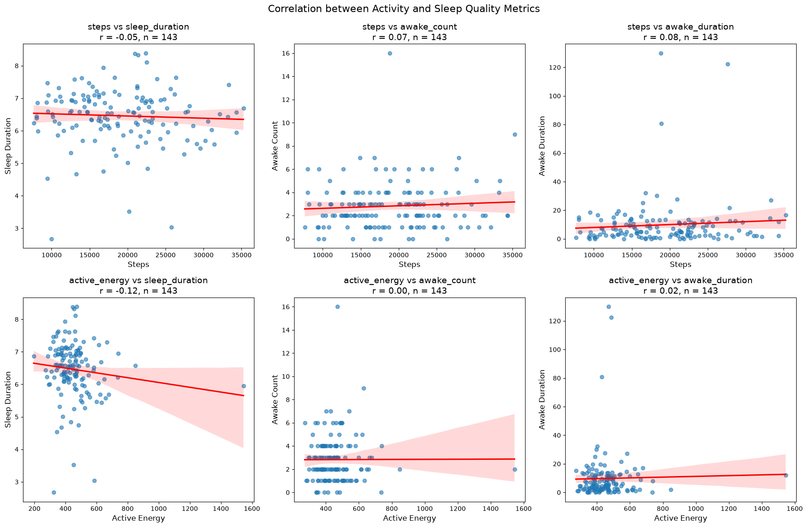

# データ分析レポート

## 概要
本レポートは、Apple Watchなどのウェアラブルデバイスから取得された日々の活動量データ（歩数、アクティブエネルギー消費量）と夜間の睡眠データ（睡眠時間、中途覚醒回数、中途覚醒時間）の間の相関関係を分析した結果をまとめたものです。日中の活動が睡眠の質にどのような影響を与えるかを理解し、個人の健康管理における示唆を得ることを目的としています。分析の結果、本データセットにおいては、日中の活動量指標と夜間の睡眠の質指標の間に、統計的に有意な強い相関は見られないことが明らかになりました。

## 分析の目的と仮説
### 目的
日中の活動量（歩数、アクティブエネルギー）と夜間の睡眠の質（睡眠時間、中途覚醒回数、中途覚醒時間）の相関関係を分析し、健康管理におけるインサイトを導き出します。

### 仮説
一般的な健康に関する知見に基づき、以下の仮説を立てました。
- **仮説1**: 日中の活動量（`steps`, `active_energy`）が増加すると、睡眠の質は向上する。具体的には、`sleep_duration`は増加し、`awake_count`と`awake_duration`は減少する傾向がある。
- **仮説2**: 適度な活動量は良質な睡眠に寄与するが、過度な活動は逆に睡眠を妨げる可能性も考慮に入れる。ただし、本分析では単純な線形相関に焦点を当てます。

## データセットの説明

### データソースと取得期間
本分析で使用したデータは、`2-data/20260629-apple-watch/health_metrics_all.csv` に格納された個人向けヘルスケア指標データです。このデータは、2026年2月1日から2026年7月3日までの期間における日々の活動量と睡眠に関する指標を記録しています。

### データ構造
データセットは150件の観測値と12個の列で構成されています。
以下に各列の詳細を示します。

| カラム名                 | データ型   | 説明                                      |
|:-------------------------|:-----------|:------------------------------------------|
| `date`                   | `str`      | データが記録された日付                     |
| `sleep_duration`         | `float64`  | 睡眠時間 (時間)                           |
| `steps`                  | `float64`  | 歩数                                      |
| `active_energy`          | `float64`  | アクティブエネルギー消費量 (kcal)         |
| `exercise_time`          | `float64`  | エクササイズ時間 (分)                     |
| `stand_hours`            | `float64`  | スタンド時間 (時間)                       |
| `sleep_onset`            | `float64`  | 睡眠開始時刻 (午前0時からの時間、例: 25.0は午前1時) |
| `wake_time`              | `float64`  | 起床時刻 (午前0時からの時間、例: 32.0は午前8時) |
| `awake_count`            | `float64`  | 中途覚醒回数 (回)                         |
| `awake_duration`         | `float64`  | 中途覚醒時間 (分)                         |
| `longest_awake_duration` | `float64`  | 最長の中途覚醒時間 (分)                   |
| `first_morning_awake_time` | `float64` | 起床後最初に覚醒した時間 (午前0時からの時間)|

### 欠損値の状況と処理
データセットにはいくつかの列に欠損値（NaN）が含まれています。特に、`sleep_duration`、`steps`、`active_energy`、`exercise_time`、`stand_hours`、`sleep_onset`、`wake_time`、`awake_count`、`awake_duration`、`longest_awake_duration`、`first_morning_awake_time` には欠損値が存在します。

本分析では、相関係数算出および可視化のために、対象となる各変数ペアについて欠損値を除外（listwise deletion）して分析を行いました。これにより、有効なデータ点のみを用いて正確な相関係数を算出しています。

### サンプルデータ
以下に、データセットのランダムな5行を示します。

|     | date       |   sleep_duration |   steps |   active_energy |   exercise_time |   stand_hours |   sleep_onset |   wake_time |   awake_count |   awake_duration |   longest_awake_duration |   first_morning_awake_time |
|----:|:-----------|-----------------:|--------:|----------------:|----------------:|--------------:|--------------:|------------:|--------------:|-----------------:|-------------------------:|---------------------------:|
|  76 | 2026-04-18 |          6.89    |   23136 |         490.496 |              43 |            13 |       26.35   |     33.0303 |             6 |          9.51667 |                  4.01667 |                    29.0083 |
|  11 | 2026-02-12 |          6.28778 |   16444 |         386.992 |              16 |            13 |       25.6    |     31.5961 |             2 |         25.0833  |                 23.0833  |                    31.1528 |
| 147 | 2026-06-28 |        nan       |     nan |         nan     |             nan |           nan |      nan      |    nan      |           nan |        nan       |                nan       |                   nan      |
|  52 | 2026-03-25 |          6.09583 |   12719 |         387     |              32 |            14 |       25.7167 |     32.455  |             4 |         11.5333  |                  4.51667 |                    30.0383 |
| 112 | 2026-05-24 |          6.6975  |   25189 |         504.603 |              51 |            15 |       25.9667 |     32.625  |             2 |         11.55    |                 11.0333  |                    30.9444 |

## 分析結果詳細

### 1. 相関係数と有効サンプル数

- **概要**:
    日中の活動量指標（`steps`: 歩数, `active_energy`: アクティブエネルギー消費量）と夜間の睡眠の質指標（`sleep_duration`: 睡眠時間, `awake_count`: 中途覚醒回数, `awake_duration`: 中途覚醒時間）の間のピアソン相関係数（r）と有効サンプル数（n）を算出しました。これにより、各活動量指標と睡眠の質指標がどの程度の線形関係にあるかを数値的に評価します。

- **分析結果**:
    以下の表に、各ペアの相関係数（r）と分析に使用された有効なサンプル数（n）を示します。

## Correlation Analysis Results: Activity vs. Sleep Quality
| Activity Metric   | Sleep Metric   |   Correlation Coefficient (r) |   Sample Size (n) |
|:------------------|:---------------|------------------------------:|------------------:|
| steps             | sleep_duration |                        -0.051 |               143 |
| steps             | awake_count    |                         0.069 |               143 |
| steps             | awake_duration |                         0.079 |               143 |
| active_energy     | sleep_duration |                        -0.116 |               143 |
| active_energy     | awake_count    |                         0.003 |               143 |
| active_energy     | awake_duration |                         0.021 |               143 |

- **示唆**:
    上記の表から、全てのペアにおいて相関係数の絶対値が0.2を下回っており、日中の活動量指標と夜間の睡眠の質指標の間に**非常に弱い線形相関**しか見られないことが示されました。

    - `steps` と `sleep_duration` (-0.051)、`active_energy` と `sleep_duration` (-0.116) は、わずかながら負の相関を示しています。これは、活動量が増えると睡眠時間がごくわずかに減少する傾向があることを示唆しますが、その関係性は極めて弱いです。
    - `steps` と `awake_count` (0.069)、`steps` と `awake_duration` (0.079) は、ごくわずかながら正の相関を示しています。これは、歩数が増えると中途覚醒回数や中途覚醒時間がごくわずかに増加する傾向があることを示唆します。
    - `active_energy` と `awake_count` (0.003) はほぼ無相関であり、`active_energy` と `awake_duration` (0.021) も極めて弱い正の相関しか見られません。

    全体として、当初の仮説「活動量が増加すると睡眠の質が向上する（睡眠時間増加、中途覚醒減少）」は、このデータセットからは強く支持されませんでした。むしろ、一部の指標では逆の、しかし極めて弱い傾向が見られました。

### 2. 相関関係の可視化

- **概要**:
    日中の活動量指標と夜間の睡眠の質指標の間の関係性をより直感的に理解するため、6つの異なるペアについて散布図を作成しました。各散布図にはトレンド線（回帰直線）を追加し、相関係数（r）と有効サンプル数（n）を明記しています。

- **分析結果**:
    以下に、各活動量と睡眠の質のペアに関する散布図を示します。これらのグラフは、データ点の分布とトレンド線の傾きを通じて、前述の相関係数を視覚的に補強します。

- **示唆**:
    散布図は、相関係数によって示された「非常に弱い相関」を視覚的に裏付けています。ほとんどのグラフでデータ点が広範囲に散らばっており、特定の明確なトレンドは確認できません。トレンド線は非常に緩やかな傾きを示しており、活動量の変化が睡眠の質に与える影響が小さいことを示唆しています。

    例えば、「Steps vs Sleep Duration」のグラフでは、歩数が増えても睡眠時間が大きく変動するパターンは見られず、トレンド線もほぼ水平に近いです。これは、このデータセットにおいては、単に歩数やアクティブエネルギー量が多いからといって、一義的に睡眠の質が向上する、あるいは悪化するという強い傾向はないことを示しています。日々の活動量と睡眠の質の関係は、単純な線形モデルでは捉えきれない、より複雑な要因が絡み合っている可能性があります。

## まとめと考察

本分析では、日中の活動量（歩数、アクティブエネルギー）と夜間の睡眠の質（睡眠時間、中途覚醒回数、中途覚醒時間）の間の相関関係を調査しました。結果として、全てのペアにおいてピアソン相関係数の絶対値が0.2以下と非常に小さく、**統計的に有意な強い線形相関は認められない**という結論に至りました。

この結果は、当初立てた「適切な活動量は良質な睡眠に繋がる」という仮説をこのデータセットにおいては直接的に支持しないものでした。これは、必ずしも活動量が睡眠に影響を与えないという意味ではなく、以下の可能性が考えられます。

1.  **非線形な関係**: 活動量と睡眠の質の間には、線形ではない非線形な関係が存在する可能性があります（例: 適度な活動は良いが、少なすぎても多すぎても悪い）。
2.  **媒介変数・交絡変数**: 活動量と睡眠の質の間には、食事、ストレス、カフェイン摂取、アルコール摂取、体調、室温、寝室環境など、他の多くの要因が影響を与えている可能性があります。これらの要因が相関を弱めている、あるいは見えにくくしている可能性があります。
3.  **個人差**: 睡眠に対する活動量の影響は、個人によって大きく異なる可能性があります。一律の傾向が見られないのは、個々の生活習慣や生理的特性の違いが影響しているためかもしれません。
4.  **測定の粒度**: 使用された活動量や睡眠の指標が、その関係性を捉えるには粗すぎる可能性があります（例: 活動の種類や強度、睡眠の深さなど）。
5.  **因果関係の欠如**: 相関が低いことは、両者に直接的な因果関係がない、または非常に弱いことを示唆します。

重要な点は、**相関関係は因果関係を意味しない**ということです。今回の分析結果は、このデータセットの範囲内では、活動量と睡眠の質が単純な線形関係で強く結びついているわけではないという事実を示しています。

## ネクストアクション

本分析結果を踏まえ、日中の活動と睡眠の質に関する理解を深めるために、以下のネクストアクションを提案します。

-   **多変量解析の実施**: 活動量と睡眠の質に影響を与えると考えられる他の要因（例: 運動強度、食事内容、カフェイン摂取量、ストレスレベル、日中の光曝露、室温など）のデータを収集し、重回帰分析や機械学習モデルを用いて、より複雑な関係性や影響因子を特定します。
-   **時間帯別の活動量の考慮**: 活動の時間帯（例: 夕方の激しい運動）が睡眠に与える影響を分析するために、活動量を時間帯別に分解して分析します。
-   **非線形モデルの検討**: 活動量と睡眠の質の間に非線形な関係がある可能性を考慮し、スプライン回帰などの非線形モデルを適用して分析を行います。
-   **個別分析の実施**: 大規模な集団の傾向だけでなく、個々人の時系列データに基づいた分析を実施し、個別の最適解やパターンを特定します。
-   **データ収集の改善**: 睡眠の質のより詳細な指標（例: 睡眠ステージの割合、入眠潜時）や、活動の質（例: 運動の種類、継続時間）に関するデータを追加で収集することを検討します。
-   **介入研究の検討**: 特定の活動パターンが睡眠に与える因果関係を検証するため、A/Bテストのような介入研究の実施を検討します。