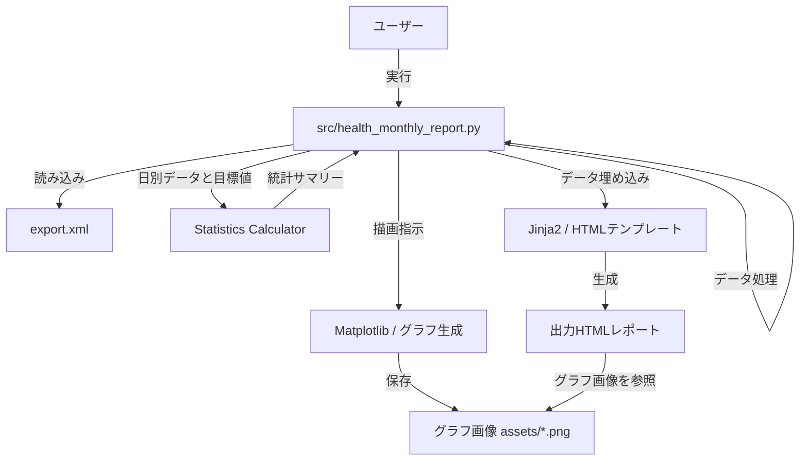
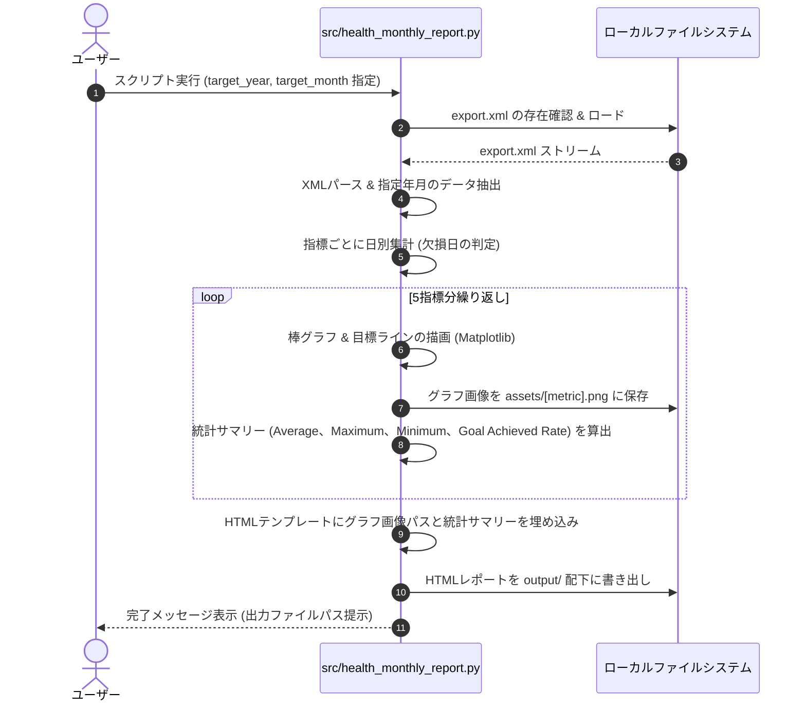

# 機能設計書 (Functional Design Document)

## システム構成図

本システムは、ユーザーがローカル環境でPythonスクリプトを実行し、`export.xml` を入力として、グラフ画像、月次統計サマリー、および最終成果物であるHTMLレポートを自動生成するスタンドアロンツールです。



---

## 技術スタック

| 分類 | 技術 | 選定理由 |
|------|------|----------|
| 言語 | Python 3.x | XML解析、データ処理、グラフ生成ライブラリが豊富で、ローカル実行が容易なため。 |
| パッケージ管理 | uv | 仮想環境の構築および依存ライブラリのインストールを高速かつ安定して行うため。 |
| XMLパース | `xml.etree.ElementTree` | 標準ライブラリであり、`iterparse` を使用することで大容量XMLのストリーミングパースが可能となり、メモリ消費を極小化できるため。 |
| データ集計 | `pandas` | 時系列データのフィルタリング、日別集計、欠損値処理などを直感的かつ高速に行うため。 |
| グラフ生成 | `matplotlib` | 日別の棒グラフや目標ラインの描画を柔軟にカスタマイズし、高品質な画像として保存するため。 |
| テンプレート | `jinja2` | HTML/CSS構造とPythonデータを分離し、可読性の高いコードでHTMLファイルを生成するため。 |

---

## データモデル定義

### 入力データ: Apple Health XML (`export.xml`)

AppleヘルスケアAppからエクスポートされるXMLファイルは、主に `<Record>` 要素から構成されます。

#### Record要素の構造（パース対象属性）
```xml
<Record type="HKQuantityTypeIdentifierStepCount" value="1250" unit="count" startDate="2026-02-01 10:15:30 +0900" endDate="2026-02-01 10:20:00 +0900"/>
```

#### パース対象の Record Type マッピング
| 指標 | XML Record Type (`type`) | 単位 (`unit`) | 集計方法 |
| :--- | :--- | :--- | :--- |
| **Sleep Duration** | `HKCategoryValueSleepAnalysis` (値が睡眠中を表す `HKCategoryValueSleepAnalysisAsleep*` のレコード) | なし | `endDate` - `startDate` の日別合計時間（hour）。睡眠ステージ別の内訳は扱わない。 |
| **Steps** | `HKQuantityTypeIdentifierStepCount` | `count` | `value` の日別合計値 |
| **Active Energy Burned** | `HKQuantityTypeIdentifierActiveEnergyBurned` | `kcal` | `value` の日別合計値 |
| **Exercise Time** | `HKQuantityTypeIdentifierAppleExerciseTime` | `min` | `value` の日別合計値 |
| **Stand Hours** | `HKQuantityTypeIdentifierAppleStandHour` (値が `HKAppleStandHourValueStood` のレコード) | なし | 1日の中でスタンドしたユニークな時間数（hour） |

---

### 内部処理用データモデル

#### DailyMetric (日別集計データ)
```python
from typing import TypedDict, Optional
from datetime import date

class DailyMetric(TypedDict):
    date: date            # 集計日 (YYYY-MM-DD)
    value: Optional[float] # 指標値（データ欠損の場合は None）
```

---

## ユースケースシーケンス



---

## アルゴリズム設計

### 1. 欠損日の判定と統計処理
Apple Watchの未装着日などを正しく扱うため、以下のアルゴリズムを適用します。

1. **対象日リストの生成**:
   指定された `target_year` と `target_month` のすべての日付（例: 2026年2月であれば 2/1 〜 2/28 の28日間）のマスターリストを生成します。
2. **データのマージ**:
   パースした実データの日別集計結果を、対象日リストを基準に左結合します。
3. **欠損の判定**:
   該当日に対象指標のレコードが1件も存在しない場合、値を `0` とせず `None` (欠損) として保持します。対象指標のレコードが存在し、集計結果が0の場合は実測値 `0` として扱います。
4. **統計計算時の除外**:
   平均値や目標達成率の計算において、値が `None` の日は母数および分子から完全に除外します。
   - `平均値 = (欠損を除外した有効な日の合計値) / (有効な日数)`
   - `目標達成率 = (目標値以上の有効な日数) / (有効な日数) * 100 (%)`

### 2. 日付・タイムゾーン処理
Apple Health XML の `startDate` / `endDate` にはタイムゾーンオフセットが含まれるため、パース時はオフセットを保持した日時として扱います。日別集計はレコード上のローカル日付を基準に行います。

- 睡眠など期間を持つデータが日付をまたぐ場合は、対象日ごとに期間を分割して集計します。
- 月境界をまたぐ期間データは、対象月に重なる部分だけを集計対象とします。
- 歩数・活動エネルギー・エクササイズ時間などの短時間数量レコードは、原則として `startDate` の日付に割り当てます。

### 3. 統計サマリー構築
各指標の欠損日を除外した有効値から、表示用に以下の4項目を固定順で構築します。

- Average: 有効日の平均値
- Maximum: 有効日の最大値
- Minimum: 有効日の最小値
- Goal Achieved Rate: 目標値以上の有効日数 / 有効日数 * 100

有効日が0日の場合、すべての表示値は `N/A` とします。

---

## UI（HTML/CSS）設計

### 画面仕様
- **解像度**: 1スライドあたり `1920px × 1080px` (アスペクト比 16:9)
- **レイアウト方式**: スライドを縦方向に単純に並べる（5スライド）。CSSのスクロールスナップによる制御は行わず、ブラウザの標準スクロールで閲覧可能にします。
- **テーマ**: ダークモード調のモダンで洗練されたデザイン。
  - 背景色: `#0f172a` (Slate 900)
  - 文字色: `#f8fafc` (Slate 50)
  - アクセント: `#38bdf8` (Sky 400)

### スライド内配置
```
+-----------------------------------------------------------------------------+
|  [Metric Title] (e.g., Sleep Duration)                       [YYYY-MM]      |
|  +-----------------------------------------------------------------------+  |
|  |                         Daily Bar Chart (Image)                       |  |
|  +-----------------------------------------------------------------------+  |
|  Monthly Stats                                                            |
|  [Average] [Maximum] [Minimum] [Goal Achieved Rate]       Goal: 7 hours    |
+-----------------------------------------------------------------------------+
```

- **左側（グラフ領域）**:
  - `output/assets/[metric].png` を埋め込み表示。
  - 枠線や背景をHTML全体のダークテーマに馴染むようにMatplotlib側で透過・調整する。
- **下部（統計サマリー領域）**:
  - Average、Maximum、Minimum、Goal Achieved Rate をカード状に表示。
  - 値と単位を分けて表示し、欠損日しかない指標は `N/A` を表示する。

---

## エラーハンドリング

| エラー種別 | 処理内容 | ユーザーへの表示 |
|-----------|------|-----------------|
| `export.xml` が存在しない | 処理を中断する | `Error: export.xml not found. Please place the exported XML file in the project root directory.` |
| XMLのパースエラー | 不正なXMLフォーマットの場合、処理を中断してログを出力 | `Error: Failed to parse XML file. The file may be corrupted.` |
