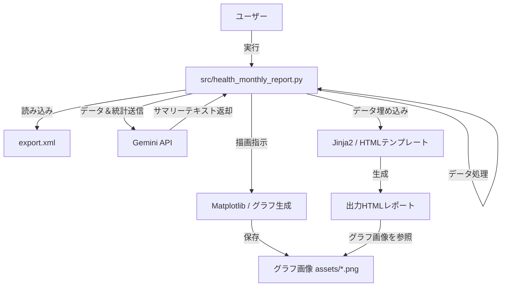
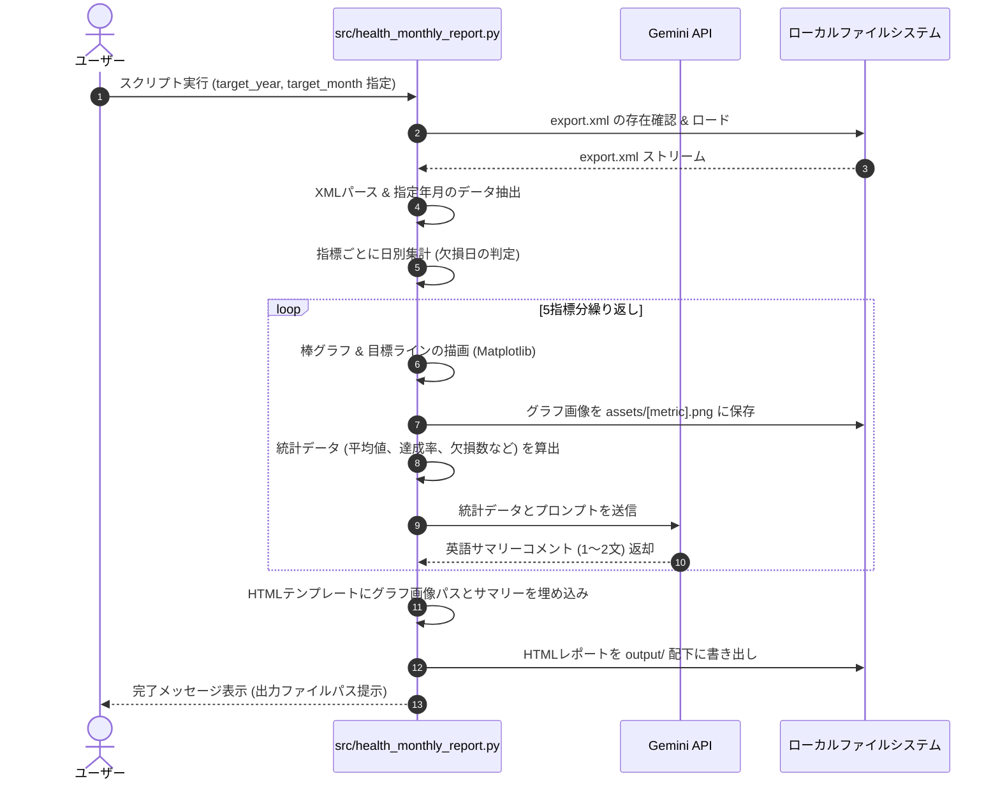

# 機能設計書 (Functional Design Document)

## システム構成図

本システムは、ユーザーがローカル環境でPythonスクリプトを実行し、`export.xml` を入力として、Gemini APIと連携しながらグラフ画像および最終成果物であるHTMLレポートを自動生成するスタンドアロンツールです。



---

## 技術スタック

| 分類 | 技術 | 選定理由 |
|------|------|----------|
| 言語 | Python 3.x | XML解析、データ処理、グラフ生成、API連携ライブラリが豊富で、ローカル実行が容易なため。 |
| パッケージ管理 | uv | 仮想環境の構築および依存ライブラリのインストールを高速かつ安定して行うため。 |
| XMLパース | `xml.etree.ElementTree` | 標準ライブラリであり、`iterparse` を使用することで大容量XMLのストリーミングパースが可能となり、メモリ消費を極小化できるため。 |
| データ集計 | `pandas` | 時系列データのフィルタリング、日別集計、欠損値処理などを直感的かつ高速に行うため。 |
| グラフ生成 | `matplotlib` | 日別の棒グラフや目標ラインの描画を柔軟にカスタマイズし、高品質な画像として保存するため。 |
| API連携 | `google-genai` | Gemini APIへのアクセスとレスポンス取得を行うため。 |
| テンプレート | `jinja2` | HTML/CSS構造とPythonデータを分離し、可読性の高いコードでHTMLファイルを生成するため。 |

---

## データモデル定義

### 入力データ: Apple Health XML (`export.xml`)

AppleヘルスケアAppからエクスポートされるXMLファイルは、主に `<Record>` 要素から構成されます。

#### Record要素の構造（パース対象属性）
```xml
<Record type="HKQuantityTypeIdentifierStepCount" value="1250" unit="count" startDate="2026-02-01 10:15:30 +0900" endDate="2026-02-01 10:20:00 +0900"/>
```

#### パース対象の Record Type マッピング
| 指標 | XML Record Type (`type`) | 単位 (`unit`) | 集計方法 |
| :--- | :--- | :--- | :--- |
| **Sleep Duration** | `HKCategoryValueSleepAnalysis` (値が睡眠中を表す `HKCategoryValueSleepAnalysisAsleep*` のレコード) | なし | `endDate` - `startDate` の日別合計時間（hour）。睡眠ステージ別の内訳は扱わない。 |
| **Steps** | `HKQuantityTypeIdentifierStepCount` | `count` | `value` の日別合計値 |
| **Active Energy Burned** | `HKQuantityTypeIdentifierActiveEnergyBurned` | `kcal` | `value` の日別合計値 |
| **Exercise Time** | `HKQuantityTypeIdentifierAppleExerciseTime` | `min` | `value` の日別合計値 |
| **Stand Hours** | `HKQuantityTypeIdentifierAppleStandHour` (値が `HKAppleStandHourValueStood` のレコード) | なし | 1日の中でスタンドしたユニークな時間数（hour） |

---

### 内部処理用データモデル

#### DailyMetric (日別集計データ)
```python
from typing import TypedDict, Optional
from datetime import date

class DailyMetric(TypedDict):
    date: date            # 集計日 (YYYY-MM-DD)
    value: Optional[float] # 指標値（データ欠損の場合は None）
```

---

## ユースケースシーケンス



---

## アルゴリズム設計

### 1. 欠損日の判定と統計処理
Apple Watchの未装着日などを正しく扱うため、以下のアルゴリズムを適用します。

1. **対象日リストの生成**:
   指定された `target_year` と `target_month` のすべての日付（例: 2026年2月であれば 2/1 〜 2/28 の28日間）のマスターリストを生成します。
2. **データのマージ**:
   パースした実データの日別集計結果を、対象日リストを基準に左結合します。
3. **欠損の判定**:
   該当日に対象指標のレコードが1件も存在しない場合、値を `0` とせず `None` (欠損) として保持します。対象指標のレコードが存在し、集計結果が0の場合は実測値 `0` として扱います。
4. **統計計算時の除外**:
   平均値や目標達成率の計算において、値が `None` の日は母数および分子から完全に除外します。
   - `平均値 = (欠損を除外した有効な日の合計値) / (有効な日数)`
   - `目標達成率 = (目標値以上の有効な日数) / (有効な日数) * 100 (%)`

### 2. 日付・タイムゾーン処理
Apple Health XML の `startDate` / `endDate` にはタイムゾーンオフセットが含まれるため、パース時はオフセットを保持した日時として扱います。日別集計はレコード上のローカル日付を基準に行います。

- 睡眠など期間を持つデータが日付をまたぐ場合は、対象日ごとに期間を分割して集計します。
- 月境界をまたぐ期間データは、対象月に重なる部分だけを集計対象とします。
- 歩数・活動エネルギー・エクササイズ時間などの短時間数量レコードは、原則として `startDate` の日付に割り当てます。

### 3. Gemini API プロンプト構築
Gemini API に対して、統計情報と文脈を正確に伝えるためのプロンプトを指標ごとに動的に構築します。

#### プロンプトテンプレート例
```
You are a health analysis assistant.
Analyze the following monthly health data for a user's Apple Watch metric: '{metric_name}'.

- Target Month: {year}-{month}
- Target Value: {target_value} {unit} or more
- Average Value (excluding missing days): {average_value:.1f} {unit}
- Maximum Value: {max_value:.1f} {unit}
- Goal Achievement Rate: {achievement_rate:.1f}% ({achieved_days} out of {valid_days} active days)
- Missing Days (Watch not worn): {missing_days} days

Daily Values (Missing days are marked as 'N/A'):
{daily_values_text}

Instruction:
Please generate a concise summary comment in English (exactly 1 or 2 sentences).
The comment must describe:
1. The overall trend of the month.
2. The user's achievement status against the target value.
3. A simple, actionable point for improvement if needed.

Rules:
- Output only the plain text of the 1-2 sentence comment.
- Do not include any markdown format, bold text, code blocks, or greetings.
- Keep it encouraging but objective.
```

---

## UI（HTML/CSS）設計

### 画面仕様
- **解像度**: 1スライドあたり `1920px × 1080px` (アスペクト比 16:9)
- **レイアウト方式**: スライドを縦方向に単純に並べる（5スライド）。CSSのスクロールスナップによる制御は行わず、ブラウザの標準スクロールで閲覧可能にします。
- **テーマ**: ダークモード調のモダンで洗練されたデザイン。
  - 背景色: `#0f172a` (Slate 900)
  - 文字色: `#f8fafc` (Slate 50)
  - アクセント: `#38bdf8` (Sky 400)

### スライド内配置
```
+-----------------------------------------------------------------------------+
|  [Metric Title] (e.g., Sleep Duration)                       [YYYY-MM]      |
|  Goal: 7 hours or more                                                      |
|  +---------------------------------------+   +---------------------------+  |
|  |                                       |   |  GEMINI INSIGHT           |  |
|  |                                       |   |                           |  |
|  |                                       |   |  "Your average sleep was  |  |
|  |          Daily Bar Chart              |   |   6.8 hours this month.   |  |
|  |             (Image)                   |   |   Try to maintain a       |  |
|  |                                       |   |   consistent bedtime to   |  |
|  |                                       |   |   reach your 7-hour       |  |
|  |                                       |   |   goal more often."       |  |
|  +---------------------------------------+   +---------------------------+  |
+-----------------------------------------------------------------------------+
```

- **左側（グラフ領域）**:
  - `output/assets/[metric].png` を埋め込み表示。
  - 枠線や背景をHTML全体のダークテーマに馴染むようにMatplotlib側で透過・調整する。
- **右側（インサイト領域）**:
  - Geminiによる英語コメントを大きめの文字（`font-size: 24px` 程度）で表示。
  - レンダリング時に視覚的なノイズを排除し、余白を広く取ったプレミアムなデザインにする。

---

## エラーハンドリング

| エラー種別 | 処理内容 | ユーザーへの表示 |
|-----------|------|-----------------|
| `export.xml` が存在しない | 処理を中断する | `Error: export.xml not found. Please place the exported XML file in the project root directory.` |
| APIキーが設定されていない | `GEMINI_API_KEY` 環境変数が存在しない場合、処理を即座に中断する | `Error: GEMINI_API_KEY environment variable is not set. Please set it before running the script.` |
| XMLのパースエラー | 不正なXMLフォーマットの場合、処理を中断してログを出力 | `Error: Failed to parse XML file. The file may be corrupted.` |
| Gemini API 呼び出し失敗 | APIエラーやタイムアウトが発生した場合、その指標のコメントを代替テキストにして処理を継続（全体を落とさない） | `No insight available for this metric due to API communication error.` (HTML上に表示) |
